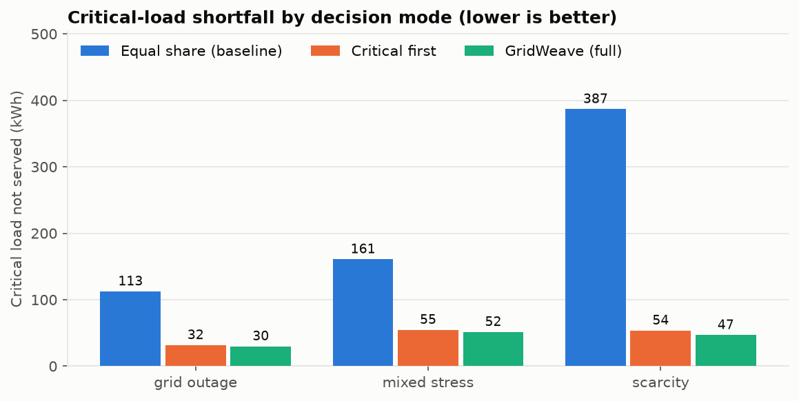
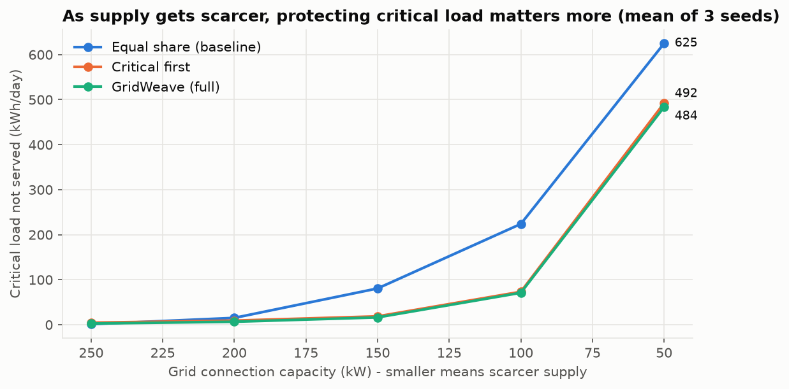

# GridWeave

**Multi-agent auction-based campus energy management and demand response simulation system.**

A campus of hostels, labs, classrooms, a library and offices shares limited electricity from a grid
connection, rooftop solar and a battery. Each building is an autonomous agent: it forecasts its own
demand with a learned model, separates critical load (labs, safety systems) from flexible load (air
conditioning, water heating), and bids into a campus energy market. The market protects critical load
and dispatches the cheapest sources first. When supply is short, buildings re-bid and give up flexible
load. After each 15-minute slot, every building settles against the demand that *actually* happened,
and postponed energy is served later or expires.

**Start here: [docs/DESIGN.md](docs/DESIGN.md).** It is the single design document: PEAS,
algorithms, validation, scenario catalogue, testing table, known limitations, viva one-liners and a
5-minute demo script.

| Workstream | Owner | Scope | Status |
|---|---|---|---|
| 1 | P1 Shantharam | Building agents, demand, forecasting, bids, settlement, shared contracts | Implemented, contract sealed ([P1_FREEZE](docs/P1_FREEZE.md)) |
| 2 | P2 Gauri | Auction: bid scoring, four allocation strategies, fairness | Implemented |
| 3 | P3 Akshitha | Grid, solar and battery agents, dispatch, events, energy accounting | Implemented |
| 4 | P4 (akolla646) | Coordinator, scenarios, operating modes, metrics, dashboards | Implemented |

## Results at a glance

Same campus, same demand, same events; only the decision-making changes:

| Critical load not served (kWh) | equal share (baseline) | critical first | **GridWeave (full)** |
|---|---:|---:|---:|
| Daytime grid outage | 112.5 | 31.7 | **29.9** |
| Cloud + outage + price spike | 160.9 | 54.7 | **51.5** |
| Supply ≈ half of demand | 386.9 | 53.7 | **46.8** |

- **Forecasting:** the learned forecaster (ridge-regression seasonal autoregression) cuts next-slot
  error by about 26% compared with the best statistical baseline, on held-out data (MAE 3.51 vs 4.74 kW).
- **Battery:** it recharges off-peak and prices its energy by what it cost, so the market saves it for
  the evening peak or an outage.
- All results are on **synthetic** demand. See [DESIGN.md §13](docs/DESIGN.md#13-known-limitations-state-these-before-anyone-asks).

<p>


</p>

## Setup

Python 3.10 or newer. The core has no runtime dependencies. matplotlib is optional (figures only).

```bash
git clone https://github.com/Shan713/GridWeave.git
cd GridWeave
python -m venv .venv
source .venv/bin/activate          # Windows: .venv\Scripts\activate
pip install -e ".[dev,viz]"
pytest
```

## Running

```bash
# Interactive dashboard: pick scenario and mode, compare modes, replay slot by slot
python scripts/run_campus_simulation.py --scenario grid_outage --web          # open http://localhost:8050

# Terminal
python scripts/run_campus_simulation.py --scenario grid_outage --compare      # three modes, side by side
python scripts/run_campus_simulation.py --scenario mixed_stress --mode equal_share
python scripts/run_campus_simulation.py --buildings 20 --days 2 --output results.json

# Evidence
python scripts/make_figures.py                 # regenerate docs/figures/*.png (+ results.json)
python scripts/run_forecast_experiment.py      # forecasting tables (development and held-out seeds)
python scripts/run_p2_experiments.py           # auction strategies
python scripts/run_p3_experiments.py           # supply and battery strategies
```

Scenarios: `normal`, `solar_drop`, `battery_outage`, `battery_derate`, `tariff_spike`,
`grid_outage`, `scarcity`, `mixed_stress` (catalogue: [DESIGN.md §10](docs/DESIGN.md#10-scenario-catalogue-mode-gridweave)).
Modes: `equal_share`, `critical_first`, `gridweave` (default).

Per-workstream demos: `examples/closed_loop_demo.py` (P1), `examples/p2_auction_demo.py`,
`examples/p3_supply_demo.py` and `examples/p4_coordinator_demo.py`.

A single building agent in code:

```python
from datetime import datetime, timedelta
from gridweave.agents import BuildingAgent
from gridweave.models import Allocation, BuildingSpec, Observation

spec = BuildingSpec("hostel_a", "Hostel A", "hostel", capacity_kw=120, critical_fraction=0.6)
agent = BuildingAgent(spec)
t0 = datetime(2026, 1, 5, 18, 0)
for i, kw in enumerate([34.0, 37.0, 39.5, 41.0]):
    agent.observe(Observation("hostel_a", t0 + i * timedelta(minutes=15), kw))

bid = agent.generate_bid()                        # forecast -> classify -> priority -> bid
allocation = Allocation(bid.bid_id, "hostel_a", bid.time_slot, 32.0)              # from the market (P2)
realised = Observation("hostel_a", bid.time_slot.start, 44.0)                     # what actually happened
settlement = agent.settle(allocation, realised)   # judged against realised demand, not the bid
print(settlement.status.value, settlement.forecast_error_kw, settlement.deferred_kw, agent.backlog_kw)
```

## Testing

```bash
pytest                                     # 581 tests: unit, integration, claim tests, doc examples
pytest --cov=gridweave                     # coverage
ruff check src tests scripts examples      # lint
```

Each claim in the design document has a named test ([DESIGN.md §12](docs/DESIGN.md#12-testing-table-review-2)).
All randomness is seeded. CI runs on Python 3.10–3.13.

## Documentation

| Document | Covers |
|---|---|
| [DESIGN.md](docs/DESIGN.md) | **Everything, in one place.** Start here |
| [building_agent.md](docs/building_agent.md), [demand_model.md](docs/demand_model.md), [forecasting.md](docs/forecasting.md) | P1 details |
| [auction.md](docs/auction.md), [allocation_algorithms.md](docs/allocation_algorithms.md), [fairness.md](docs/fairness.md) | P2 details |
| [energy_supply_architecture.md](docs/energy_supply_architecture.md), [battery_agent.md](docs/battery_agent.md) | P3 details |
| [integration_contract.md](docs/integration_contract.md), [P1_FREEZE.md](docs/P1_FREEZE.md), [architecture.md](docs/architecture.md) | Contracts between workstreams |

## Repository layout

```
src/gridweave/   models/ interfaces contracts (shared) · agents/ forecasting/ bidding/ ... (P1)
                 auction/ (P2) · supply/ (P3) · coordinator/ (P4) · mocks/ (test doubles)
tests/           unit/ + integration/ (including test_claims.py)
scripts/         simulation CLI, experiments, figures, benchmarks
examples/        short demos per workstream
docs/            DESIGN.md, per-component docs, figures/
```

## License

MIT. See [LICENSE](LICENSE).
