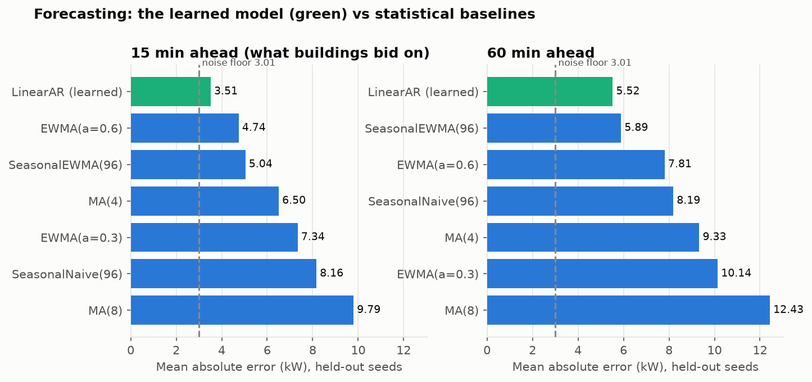
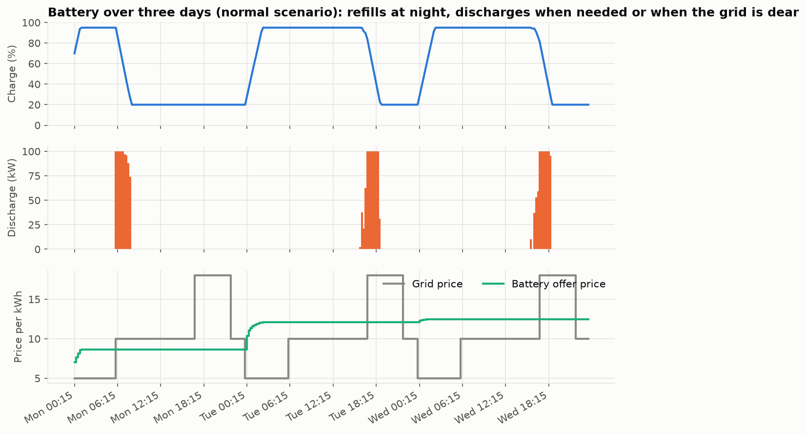
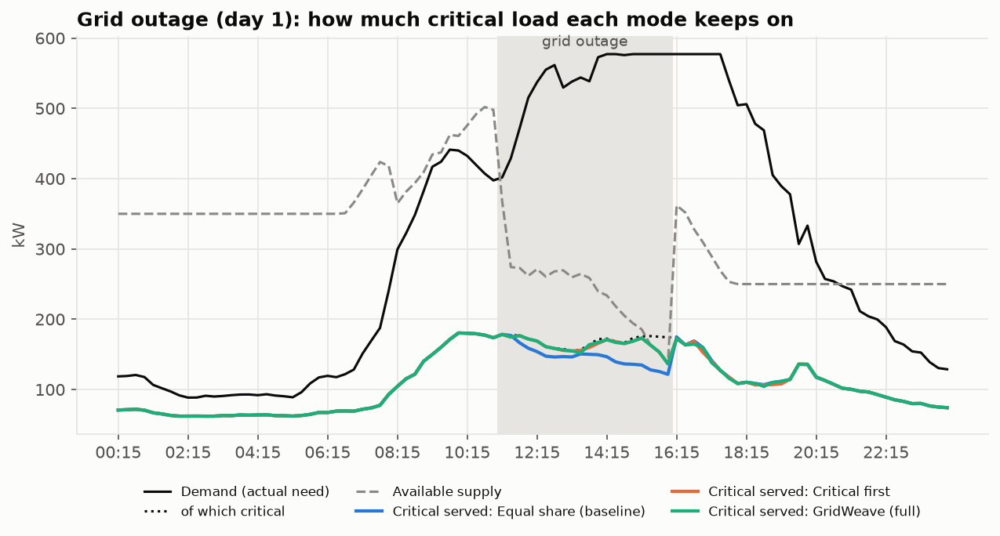

# GridWeave design document

This is the single source of truth for what GridWeave is, how it works, how we know it works,
and what it does *not* do. Read it before changing anything, and before the viva. Detailed
per-component docs are linked from each section. Every number here comes from a seeded run that
can be reproduced with the commands in §9.

## 1. What GridWeave is

A college campus has less electricity than it sometimes needs. GridWeave simulates the campus as a
**multi-agent system**:

- **building agents** that forecast their own demand and bid for power;
- **supply agents** (grid, solar, battery) that offer power;
- a **market** that decides who gets what;
- a **coordinator** that runs the campus in 15-minute slots.

When supply is short, the market protects critical load (lab equipment, safety systems), buildings
voluntarily trim flexible load (air conditioning, water heating), and postponed energy is served
later or dropped.

**Our contribution, stated precisely.** We don't claim a new auction algorithm or a new forecasting
method. We combine:

- decentralised building agents that forecast, classify load and bid;
- a tiered, welfare-maximising market with a demand-response re-bid round;
- a battery that recharges off-peak and prices its energy by what it cost;
- settlement against *realised* demand, so forecast errors, shortfalls and deferred energy have real,
  measured consequences.

The result is measured against two baselines on the same campus, demand and events (§6).

## 2. Repository layout and ownership

```
src/gridweave/
├── models/, interfaces.py, contracts.py   shared data types and cross-team contracts (P1, frozen v2.0)
├── agents/, forecasting/, classification/,
│   bidding/, simulation/, config/          P1  building intelligence
├── auction/                                P2  market mechanism
├── supply/                                 P3  grid, solar, battery, dispatch, accounting
├── coordinator/                            P4  simulation loop, scenarios, modes, metrics, dashboards
└── mocks/                                  test doubles for P2/P3/P4 (used by P1's own tests)
scripts/     CLI, experiments, figures, benchmarks        docs/figures/  generated figures + results.json
tests/       unit + integration + claim tests             examples/      short demos per workstream
```

| Person | Workstream | Main modules |
|---|---|---|
| P1 Shantharam | Building agents, demand, forecasting, bids, settlement, contracts | `agents/ forecasting/ bidding/ classification/ simulation/ models/` |
| P2 Gauri | Auction, scoring, allocation strategies, fairness | `auction/` |
| P3 Akshitha | Grid, solar and battery agents, dispatch, events, accounting | `supply/` |
| P4 (akolla646) | Coordinator, scenarios, metrics, dashboards | `coordinator/` |

**Scalability by design.** Adding buildings, scenarios or supply sources means changing a config or
dataclass, not code. Each workstream implements a `Protocol` (`DemandAgent`, `Auctioneer`,
`SupplyProvider`, `EnvironmentStream`), and `contracts.validate_clearing` / `validate_dispatch` check
every slot. So a teammate's component can be swapped without touching the others. The P1 contract is
frozen: [P1_FREEZE.md](P1_FREEZE.md).

## 3. The world model

- **Time:** discrete 15-minute slots (96 per day). Power values are slot averages; energy = power × 0.25 h.
- **Campus:** a synthetic campus of 5 buildings (hostel, lab, academic block, library, admin). It
  peaks at about 420 kW between 09:00 and 17:00, of which about 185 kW is critical. Night demand
  stays at or below about 145 kW.
- **Supply** (default scenarios):
  - grid, 250 kW, with a time-of-use tariff of 5 / 10 / 18 per kWh;
  - rooftop solar, 400 kW installed, about 270 kW at noon, free;
  - battery, 300 kWh / 100 kW, which recharges off-peak.

  The campus is fully served on a normal day only because of the solar and the battery.

**Assumptions** (state these verbatim in the viva):

1. Demand is **synthetic**: hand-designed occupancy timetables with AR(1) noise and spikes. It is
   not measured data. It repeats a daily template, which favours seasonal forecasters
   ([demand_model.md](demand_model.md)).
2. A building can switch its own flexible loads. It serves critical load first, then postponed
   energy, then new flexible load.
3. Postponed ("deferred") energy must be served within 8 slots (2 h) or it expires.
4. Bid quantities are honest forecasts. Whether honest reporting is in a building's interest depends
   on the market rule (§13).
5. The coordinator is trusted, and all agents act once per slot, in a fixed order.

## 4. PEAS and environment (Review 1)

| Agent | Performance measure | Environment | Actuators | Sensors |
|---|---|---|---|---|
| **Building** (P1) | Share of *realised* demand served; critical-load shortfall; expired and curtailed energy; forecast error; cost | Its own demand (stochastic); the market; the coordinator's scarcity signal | Bid (requested / minimum / critical / flexible kW, priority, price); revised bid under scarcity; serve / defer / curtail at settlement | Its meter (realised demand per slot); the scarcity signal; its allocation; its own settlement history |
| **Market** (P2) | Critical load protected; social welfare; fairness (Jain's index); no building starved | All bids and supply offers for the slot | Allocations to buildings; dispatch requests to sources; clearing price | Bids; supply offers |
| **Supply agents** (P3) | Energy delivered; cost; renewable share; battery state of charge kept within limits | Weather (solar), tariffs, outages, the battery's charge level | Supply offers (kW and price per source); dispatch; battery charging | Time of day, events, battery state, dispatch requests |
| **Coordinator** (P4) | Campus-wide service, critical protection, conservation, no stuck agents | All agents, the scenario's event schedule | Advances time, triggers events, runs bidding rounds, feeds settlements back | Every record, every failure |

| Property | Value | Why |
|---|---|---|
| Observable | **Partially** | A building sees only its own meter and the scarcity signal. It must forecast its own demand and never sees other bids |
| Deterministic | **Stochastic** | Demand has noise and spikes; supply has events; outcomes depend on other agents |
| Episodic | **Sequential** | Deferred energy, battery charge and each building's deprivation state carry consequences forward |
| Static | **Dynamic** | Demand, solar and tariffs change every slot; outages happen mid-run |
| Discrete | **Discrete time, continuous quantities** | 15-min slots; kW and kWh are real numbers |
| Agents | **Multi-agent, competitive over a shared resource, cooperative at campus level** | Buildings compete through the market; the market maximises campus welfare |
| Known | **Known rules** | Market, settlement and physics rules are fixed and documented |

**Agent type.** A building is a *model-based* agent with parameterised decision rules. It keeps
state (history, deferred-energy queue, deprivation) and uses a learned forecasting model. It does
not maximise a utility function; the *market* does (§5.5). A simple reflex agent (bid your current
reading) would under-bid ahead of the morning ramp and couldn't carry deferred energy.

## 5. Algorithms

### 5.1 Forecasting — [forecasting.md](forecasting.md)

The default is **LinearAR**, a learned model: ridge regression on each building's own history,
`y(t+1) = w · [1, y(t), y(t−1), y(t−2), y(t+1−96), y(t+1−96) − y(t−96)]`. It refits every 16
slots and uses EWMA until it has 1.5 days of history. It was compared with four statistical
baselines by rolling-origin backtest: chosen on seeds 42–44, confirmed on held-out seeds 101–105.

| Held-out MAE | next slot (what buildings bid on) | 1 hour ahead |
|---|---:|---:|
| **LinearAR (learned)** | **3.51 kW** | **5.52 kW** (RMSE slightly worse than Seasonal EWMA) |
| EWMA α=0.6 | 4.74 | 7.81 |
| Seasonal EWMA | 5.04 | 5.89 |
| noise floor (oracle) | 3.01 | 3.01 |



### 5.2 Load classification and bids — [building_agent.md](building_agent.md), [bid_contract.md](bid_contract.md)

- **Critical load:** `critical = min(forecast, max(operational floor, critical_fraction × forecast))`.
- **Minimum:** `minimum = critical + comfort floor`.
- **Priority** (0–1) is a weighted sum of criticality, building importance, urgency of postponed
  energy, and deprivation (an EWMA of how short the building has recently been).
- **Willingness to pay** rises from a base price toward a cap, with priority, scarcity and deprivation.

### 5.3 Demand response

If the coordinator sees total requests exceed supply, it announces `scarcity = 1 − supply / requested`.
Each building re-bids with `requested −= scarcity × 0.5 × (requested − minimum)`. It gives up
flexible load only, never critical or minimum load.

### 5.4 Settlement — the slot really happens

After the slot, each building compares its allocation with the demand that *actually* occurred:
`served = min(allocated, real need)`. Critical load is served first, then postponed energy, then new
flexible load. Unmet critical load is recorded as a **critical shortfall**. Unmet flexible load is
deferred (with a deadline) or curtailed. Every kWh of demand ends up in exactly one bucket (§7).

### 5.5 Market clearing — where the optimisation is — [allocation_algorithms.md](allocation_algorithms.md)

| Strategy | Rule | Role |
|---|---|---|
| `ProportionalAllocationStrategy` | Everyone gets the same fraction of their request | Baseline 1 (`equal_share` mode) |
| `PriorityAllocationStrategy` | Whole requests in priority order, ignoring critical load | Baseline 2 (deliberately weak) |
| `GreedyAllocationStrategy` | Three tiers: all critical load, then minimum floors, then flexible load by a composite score (criticality, priority, price, deprivation) | `critical_first` mode |
| `OptimizedAllocationStrategy` | Maximises Σ utility with piecewise-concave marginal utility (critical ≫ minimum ≫ flexible score), subject to supply and each bid's bounds | `gridweave` mode |

The optimised strategy solves a **continuous bounded knapsack**. Sorting marginal-utility segments
and filling greedily is provably optimal for concave utilities, in O(N log N). When supply is below
total critical load, an emergency policy shares critical supply pro rata. Supply is dispatched in
**merit order** (cheapest offer first).

### 5.6 Battery — [battery_agent.md](battery_agent.md)

- **Recharging:** off-peak (00:00–06:00), from spare grid capacity only.
- **Offer price:** wear cost + the weighted-average cost of the energy it holds, divided by the
  discharge efficiency. After charging at 5/kWh it offers at about 12.5/kWh, so the market saves
  it for the 18/kWh evening peak or an outage.



### 5.7 Coordinator loop — [integration_contract.md](integration_contract.md)

Each slot runs these steps in order:

1. Apply events.
2. Collect supply offers.
3. Bids, round 1.
4. If short, announce scarcity and re-bid.
5. Clear the market, then validate the clearing.
6. Dispatch, then validate the dispatch.
7. Reveal realised demand.
8. Settle every building.
9. Feed back to the environment.

If the market or dispatch fails, every building settles at zero. If a settlement fails, it is
reported and the building's history stays consistent. No agent is ever left waiting on a bid.

## 6. Before → after: the three modes

Same campus, same demand, same events; only the decision-making changes (`coordinator/modes.py`).

| Critical load not served (kWh) | equal share (baseline) | critical first | **GridWeave (full)** |
|---|---:|---:|---:|
| `grid_outage` (11:00–16:00 outage) | 112.5 | 31.7 | **29.9** |
| `mixed_stress` (cloud + outage + price spike) | 160.9 | 54.7 | **51.5** |
| `scarcity` (supply ≈ half of demand all day) | 386.9 | 53.7 | **46.8** |


As supply shrinks, the gap widens: at a 100 kW grid, equal share leaves 224 kWh/day of critical
load unserved, against 71 kWh for GridWeave (mean of 3 seeds).




**Reading this honestly:**

- Most of the gain comes from *protecting critical load first*. P2's welfare-maximising strategy
  plus demand response adds a further 6–13% on top.
- Protecting critical load costs some fairness. In `scarcity`, Jain's index drops from 0.989 to
  0.918: equal treatment is traded for safety.
- **Total** service barely changes between modes (the same energy is shared out). What changes is
  *who* is protected.

## 7. Validation strategy — how we know it's right

1. **Every object validates itself.** Examples: critical ≤ minimum ≤ requested ≤ capacity;
   allocation ≥ 0; a supply mix sums to its allocation.
2. **Contract checks every slot** (`validate_clearing`, `validate_dispatch`):
   - one allocation per bid;
   - total allocated ≤ total supply;
   - dispatch equals allocation, and stays within each offer.
3. **Energy conservation per building:**
   `demand = served + critical shortfall + curtailed + expired + still queued`.
   `energy_balance_kwh()` is about 0 on every run and every mode. P3's accountant separately checks
   source-side balance, including grid energy used for charging.
4. **No future leakage in forecasting.** The backtest only ever sees the past; tests poison future
   values and check that forecasts don't change.
5. **Held-out evaluation.** Model choices were made on seeds 42–44 and reported on unseen seeds 101–105.
6. **Claim tests.** Each claim in this document is a named test (§12).
7. **Reproducibility.** Every run is seeded; the same seed gives an identical result.

## 8. Tools (Review 2)

| Tool | Why |
|---|---|
| Python 3.10+, standard library only for the core | Deterministic and dependency-free; anyone can run it |
| pytest, pytest-cov, ruff | 581 tests, coverage, lint; CI on Python 3.10–3.13 |
| matplotlib (optional `[viz]` extra) | Report figures only |
| `http.server` + Chart.js | Interactive dashboard without a web framework or build step |

No ML framework is needed: the learned model is a 6-feature ridge regression, and it beats the
baselines. No LLMs are used anywhere; every number comes from deterministic code.

## 9. Running everything

```bash
pip install -e ".[dev,viz]"
python scripts/run_campus_simulation.py --scenario grid_outage --web      # interactive dashboard
python scripts/run_campus_simulation.py --scenario grid_outage --compare  # the three modes, side by side
python scripts/make_figures.py                                            # regenerate docs/figures
python scripts/run_forecast_experiment.py                                 # forecasting tables
pytest                                                                    # all tests
```

## 10. Scenario catalogue (mode: GridWeave)

| Scenario | What happens | What it shows | Service | Critical served |
|---|---|---|---:|---:|
| `normal` (3 days) | No events | The baseline: fully served thanks to solar and the battery | 100.0% | 99.9% |
| `solar_drop` (2 d) | 90% cloud from 13:00 day 1 | Losing solar causes shortage | 98.4% | 99.9% |
| `battery_outage` (3 d) | Battery offline slots 48–144 | Battery unavailable; costs rise | 99.9% | 99.9% |
| `battery_derate` (2 d) | Battery capped at 20 kW | Less battery use (effect on service is small) | 100.0% | 99.9% |
| `tariff_spike` (2 d) | Grid price ×2.5 at the peak | Cost and battery timing only, *by design* | 100.0% | 99.9% |
| `grid_outage` (2 d) | Grid out 11:00–16:00 day 1 | Rationing solar and battery; the modes differ | 93.9% | 99.5% |
| `scarcity` (1 d) | Supply about half of demand | Demand response and critical protection | 62.1% | 98.3% |
| `mixed_stress` (3 d) | Cloud, then outage plus price spike | Everything at once | 95.0% | 99.4% |

## 11. Metrics — [`coordinator/metrics.py`](../src/gridweave/coordinator/metrics.py)

- **Service ratio:** served ÷ realised demand.
- **Critical served:** critical served ÷ realised critical demand.
- **Critical shortfall (kWh, events):** critical load not served, and the number of slots where it happened.
- **Expired:** deferred energy that missed its deadline.
- **Unused allocation:** allocated but not needed, caused by over-forecasting.
- **Jain's fairness:** computed over buildings' service ratios.
- **Cost:** grid energy + battery wear + grid energy used for charging.
- **Forecast MAE:** measured on settled slots.

## 12. Testing table (Review 2)

| # | Claim | Test |
|---|---|---|
| 1 | Energy is conserved for every building, in every mode | `test_modes_and_dashboard.py::test_every_mode_runs_the_same_campus_and_conserves_energy` |
| 2 | Protecting critical load more than halves critical shortfall in a daytime outage | `test_modes_and_dashboard.py::test_protecting_critical_load_cuts_critical_shortfall_during_an_outage` |
| 3 | Every supply event has a measurable effect | `test_claims.py::test_every_supply_event_changes_the_outcome` (6 scenarios) |
| 4 | The daytime outage puts supply between critical and total need | `test_claims.py::test_daytime_grid_outage_leaves_supply_between_critical_and_total_need` |
| 5 | Scarcer supply never reduces shortfall; critical-first always helps | `test_claims.py::test_scarcer_supply_never_reduces_critical_shortfall_and_critical_first_always_helps` |
| 6 | Demand response happens only in full mode, and actually cuts requests | `test_modes_and_dashboard.py::test_demand_response_round_only_in_full_mode`, `test_building_workflow.py::test_revised_bids_actually_reduce_requested_power` |
| 7 | Forecast errors have consequences | `test_building_workflow.py::test_forecast_error_reaches_outcomes` |
| 8 | The learned forecaster beats the baselines on held-out data | `test_linear_ar.py::test_beats_the_statistical_baselines_on_synthetic_campus_demand` |
| 9 | Forecasting uses no future data | `test_linear_ar.py::test_uses_no_future_data`, `test_forecasting.py::test_backtest_uses_no_future_data` |
| 10 | The battery recharges every night and is saved for the peak | `test_battery_grid_charging.py::test_battery_recovers_every_night_in_a_full_run`, `::test_grid_charged_battery_is_saved_for_the_evening_peak` |
| 11 | A market or settlement failure never strands an agent | `test_coordinator.py` (over-allocation, duplicate/missing allocation, exceptions, recovery) |
| 12 | The dashboards' numbers add up to demand | `test_dashboard_data.py::test_unserved_breakdown_partitions_demand`, `::test_building_bar_segments_sum_to_demand` |
| 13 | Runs are reproducible | `test_building_workflow.py::test_runs_are_reproducible` |
| 14 | Runs with 10–100 buildings | `test_building_workflow.py::test_runs_with_many_buildings` |

## 13. Known limitations (state these before anyone asks)

- **Synthetic demand.** Forecasting results hold on this generator only, and it favours seasonal and
  linear-autoregressive models.
- **The market is not incentive-compatible.** Pay-as-bid rewards buildings that shade their bids; we
  assume honest bidding. A VCG-style mechanism would fix this (future work).
- **P3's forecast-aware battery optimiser and solar forecaster run in P3's own experiments only.**
  The live loop uses the simpler cost-priced battery (§5.6).
- **Demand response adds little on top of critical-first.** Buildings' trimmed load is deferred, so
  the same energy is still needed later.
- **Some scenarios barely stress service.** `battery_derate` and `tariff_spike` change cost and
  battery use, not who gets power.
- **Scaling.** The loop is sequential and single-process. It is measured to about 52 ms per slot for
  100 buildings ([figure](figures/scaling.png)) and to 500 buildings in P1's benchmark, but there is
  no distributed execution.
- **Small critical shortfalls appear even on normal days.** When a building under-forecasts, the
  market can only allocate what was bid. This is correct behaviour.

## 14. Viva-ready one-liners

- **Why multi-agent, not one central optimiser?** Buildings own private information (their own
  demand and forecast) and act on it. The market combines their bids with supply offers. Each part can
  be replaced independently behind a protocol.
- **Where is the search / optimisation?** In market clearing: a continuous bounded knapsack
  maximising piecewise-concave utility, exact in O(N log N) (§5.5). Also in the ridge-regression fit
  for forecasting.
- **Is this machine learning?** The forecaster is: a supervised linear model trained on each
  building's history, evaluated on held-out data. The market and agents are deterministic algorithms.
  There are no neural networks and no LLMs.
- **Why not deep learning or RL?** On this data the linear model is already within about 0.5 kW of
  the noise floor, so there is little left to learn. RL would need a reward and far more interaction,
  and would be hard to verify.
- **Why an auction?** Buildings value power differently and only they know their needs. An auction
  turns private bids into an allocation with explicit rules and prices.
- **What guarantees critical load?** No mode can serve more than exists. When supply ≥ total critical
  demand, the critical tier (`critical_first` and `gridweave`) serves it fully. Below that, it is
  shared pro rata and every shortfall is reported. P1 alone guarantees nothing; the market enforces it.
- **What if everyone bids the maximum price?** Price stops distinguishing bids. Critical tiers,
  priority and deprivation still order them, and the scoring weight on price is only 0.20.
- **What if supply is zero?** Everyone gets 0, all critical load is reported as a shortfall, and no
  agent gets stuck (tested).
- **What if the forecast is wrong?** Settlement uses realised demand. Under-forecasts show up as
  shortfall or deferral, and over-forecasts as unused allocation (tested).
- **What if an agent or the market fails?** The coordinator validates every clearing and dispatch. On
  failure, everyone settles at zero or the error is reported; no agent is left waiting.
- **Why does fairness drop in GridWeave mode?** It deliberately favours critical load over equal
  shares. That trade-off is visible in the mode table.
- **How does it scale?** Linearly: about 0.5 ms per building per 15-minute slot (sequential, single
  process). 100 buildings take about 52 ms per slot.
- **Why does the battery charge at night?** Surplus solar almost never exists, because the market
  uses all of it. Without off-peak charging the battery emptied once and stayed empty.

## 15. Demo script (~5 minutes)

Start: `python scripts/run_campus_simulation.py --scenario grid_outage --web`, then open
http://localhost:8050.

1. **Normal day** (scenario `normal`, mode GridWeave, Run). The campus is fully served. Point at the
   battery refilling overnight and discharging at the evening peak, where its price line sits under
   the grid price line. *"Solar and the battery keep a 250 kW grid enough for a 420 kW campus."*
2. **Grid outage** (`grid_outage`). Open the replay at slot 44 (11:15), where the grid offers 0 kW.
   Step through: supply is below demand, buildings re-bid (the demand-response round), and critical
   load is still served. *"The market rations what's left and protects critical load."*
3. **Compare all modes.** Equal share leaves 113 kWh of critical load unserved; critical-first 32;
   GridWeave 30. *"Protecting critical load cuts the shortfall by about 3.8 times."*
4. **Scarcity** (`scarcity`, Compare): 387 → 54 → 47 kWh. Mention the fairness trade-off.
5. **Evidence:** show `docs/figures/` (the supply sweep and forecast error), then run `pytest` live.
