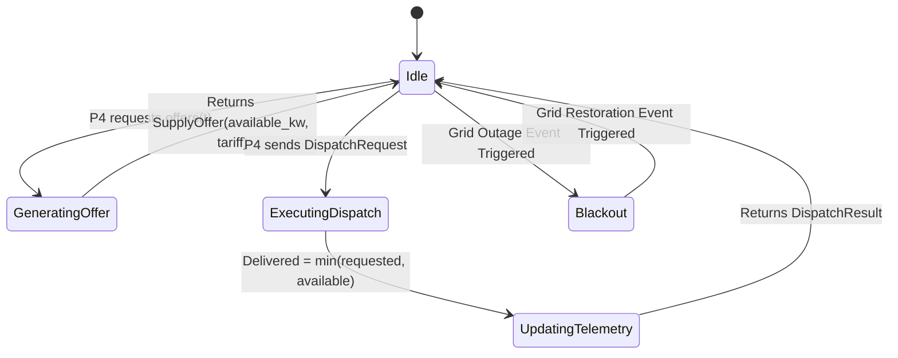

# Grid Supply Agent Specification

**Module:** `gridweave.supply.grid_agent`  
**Class:** `GridSupplyAgent`  
**Protocol:** Conforms to `SupplyProvider` source component  

---

## 1. Mathematical Formulation

### 1.1 Import Capacity Constraints
At any time slot $t \in \{1, \dots, 96\}$, the deliverable AC electrical power $P_{\text{grid}, t}$ imported from the external utility grid is bounded by:

$$0 \le P_{\text{grid}, t} \le P_{\text{grid},\max}(t)$$

where $P_{\text{grid},\max}(t)$ is the effective import limit governed by nominal plant rating $P_{\text{nom}}$, active outage windows, and emergency blackout flags:

$$P_{\text{grid},\max}(t) = \begin{cases}
0.0 & \text{if emergency outage is active} \\
P_{\text{nom}} \times \min_{w \in W(t)} \alpha_w & \text{if slot } t \text{ falls within scheduled windows } W(t) \\
P_{\text{nom}} & \text{otherwise}
\end{cases}$$

where $\alpha_w \in [0.0, 1.0]$ represents the derating capacity factor for scheduled window $w$.

### 1.2 Time-of-Use (TOU) Tariff Schedule
The marginal electricity tariff $c_{\text{grid}}(t)$ ($/kWh) varies throughout the 24-hour cycle:

$$c_{\text{grid}}(t) = \mu \times \begin{cases}
c_{\text{off-peak}} = 5.00 & 00:00 \le t < 06:00 \\
c_{\text{standard}} = 10.00 & 06:00 \le t < 17:00 \text{ and } 22:00 \le t < 24:00 \\
c_{\text{peak}} = 18.00 & 17:00 \le t < 22:00
\end{cases}$$

where $\mu \ge 1.0$ is the dynamic tariff multiplier applied during emergency price spike events.

### 1.3 Energy and Cost Accounting
For a slot of duration $\Delta t = \text{slot.hours}$ (0.25 hours for a 15-minute slot), the imported electrical energy $E_{\text{grid}, t}$ and procurement expenditure $C_{\text{grid}, t}$ are:

$$E_{\text{grid}, t} = P_{\text{grid, delivered}, t} \times \Delta t \quad [\text{kWh}]$$
$$C_{\text{grid}, t} = E_{\text{grid}, t} \times c_{\text{grid}}(t) \quad [\$]$$

---

## 2. Agent Operational Lifecycle



### 2.1 Pure Query Offer Generation
Calling `agent.get_offer(slot)` evaluates available transmission headroom and current tariff rates without mutating internal telemetry:

```python
from datetime import datetime
from gridweave.models.common import TimeSlot
from gridweave.supply.grid_agent import GridSupplyAgent

grid = GridSupplyAgent("grid", nominal_capacity_kw=400.0)
slot = TimeSlot(datetime(2026, 6, 15, 18, 0), duration_minutes=15)

offer = grid.get_offer(slot)
# Returns: SupplyOffer(source_id="grid", available_kw=400.0, marginal_price=18.0)
```

### 2.2 Physical Dispatch Execution
When P2's auction clears and issues a `DispatchRequest`, the agent validates the instruction and records delivered power:

```python
from gridweave.models.supply import DispatchRequest

req = DispatchRequest("grid", slot, requested_kw=250.0)
result = grid.dispatch(req)
# Returns: DispatchResult(delivered_kw=250.0, remaining_capacity_kw=150.0)
```
